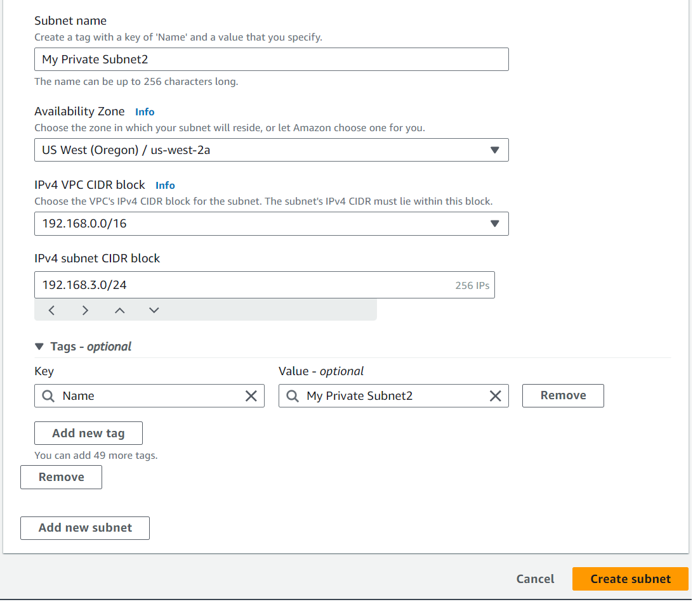
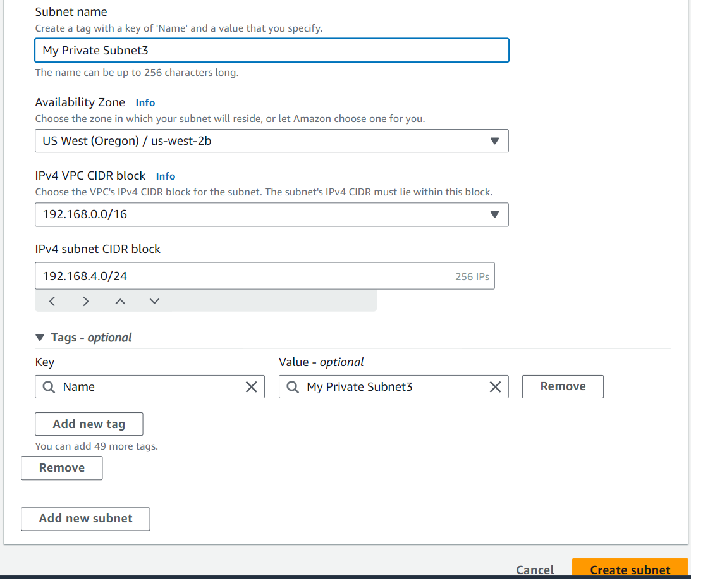
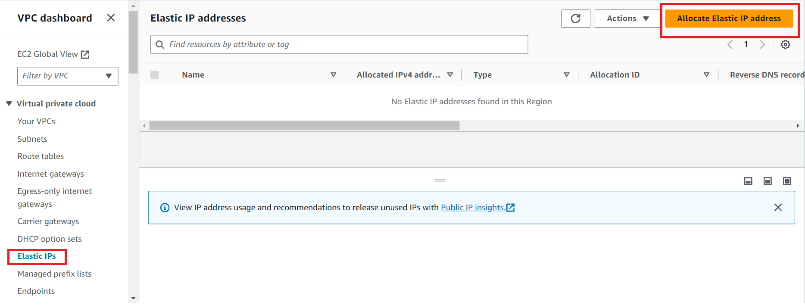
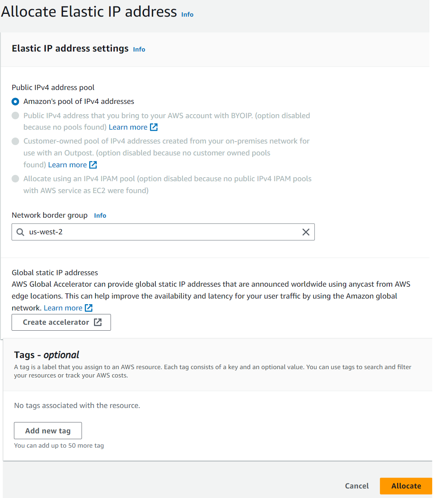
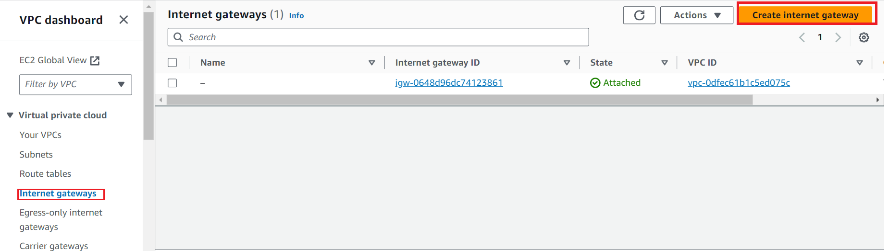
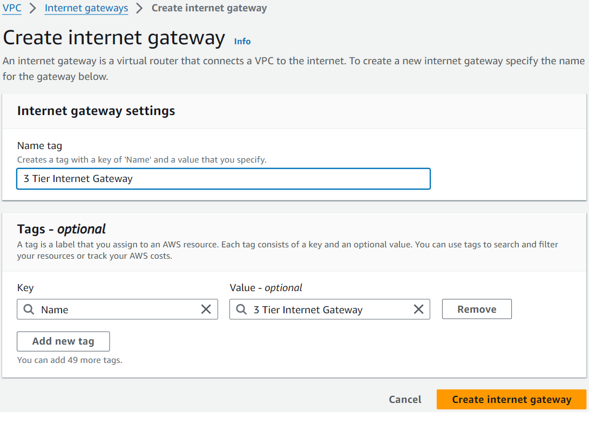
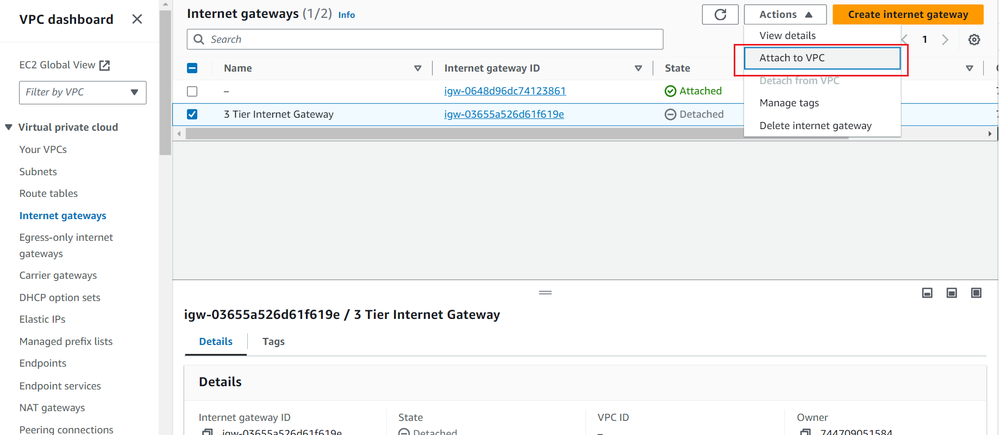
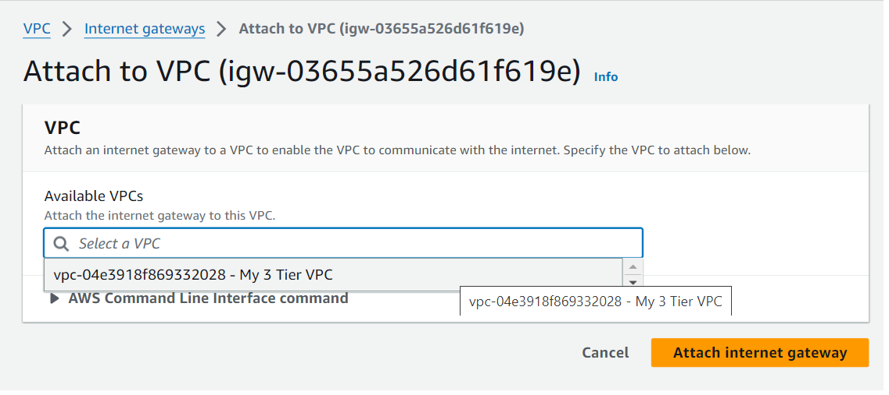
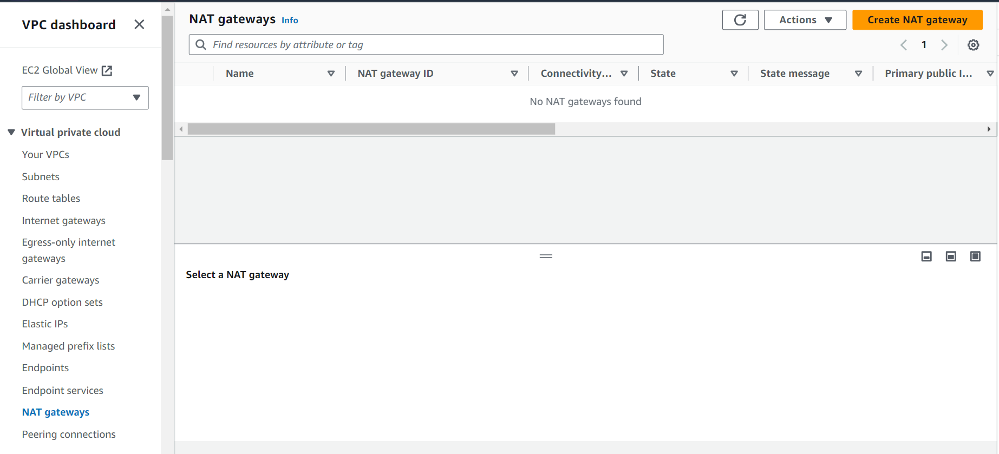

# 3-tier-AWS-Architecture
Please find below my first of a series of projects to design and configure a highly available 3 Tier architecture using AWS infrastructure. The 3 Tier are given below as shown 
- Tier 1 - User/Presentation Tier
- Tier 2 - Application Tier
- Tier 3 - Data Tier
  
See below the high level topology of 

Step 1: 
To begin with we will first setup the VPC which will host the entire 3 tier architecture.  In this step we will be creating a VPC and Subnets as well as routing and security groups. 
- Go to “Your VPCs” from the VPC service on the AWS management console and click on the orange “Create VPC” button. 

- Only create a vpc here and give it a name. Provide your own name or use the same one as shown here.

Now we will create Subnets, go to Subnets on the left hand side of the VPC service and click on it. 
- Add your VPC ID (select from the drop down where you will find it already is existing and select it. )

-	Assign it a name letting you know what it is your first public subnet
-	Put it in any availability zone and give it a CIDR of 192.168.1.0/24

-	Add a second subnet and name it Private Subnet 1 or something to let you know it is your first private subnet
-	Put it in the same availability zone as the first subnet you made and give it a CIDR of 192.168.2.0/24

-	Add a third subnet and assign a name letting you know it is the second private subnet you will be making
-	Put it in the same availability zone as your first public subnet and give it a CIDR of 192.168.3.0/24

- Add a fourth and final subnet and give it a name letting you know it is the third private subnet
- Put it in a different availability zone from the rest of your subnets and give it a CIDR of 192.168.4.0/24

- Set up for route tables 
- Allocate an Elastic IP address by going to Elastic IPs on the left hand side and click “Allocate Elastic IP address”

- Everything should be good as default but make sure that you are in the same region you have been creating everything in and then press “Allocate”. You can also add a name tag if you wish but it isn’t necessary

- We will now create an internet gateway and attach it to the VPC by going to Internet Gateways on the left hand side and clicking “Create Internet Gateway”

- We will name it something similar to what is below and then click “Create Internet Gateway”

- Once it is created attach it to your VPC by clicking “Attach to a VPC” on the top of the screen

- Click the drop down and select your vpc that you made

- Create a NAT Gateway by clicking on Nat Gateways on the left hand side and then clicking “Create NAT Gateway”

- Give it a name similar to the one below and assign it to a public subnet

- Click the drop down for Elastic IPs and click the one you created previously
- Click “Create NAT gateway”

- Create Route Tables by first heading to “Route Tables” on the left hand side
- Click “Create route table”

- Give it a name letting you know this is the public route table for your lab
- Assign your VPC to it and click “Create route table”

