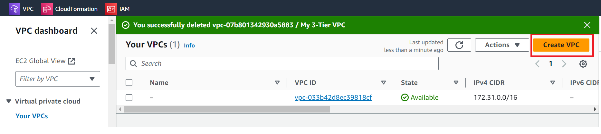
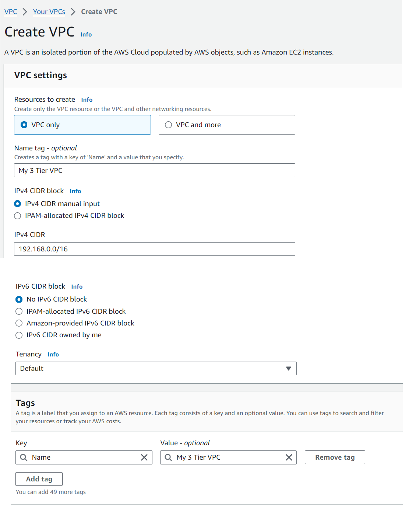
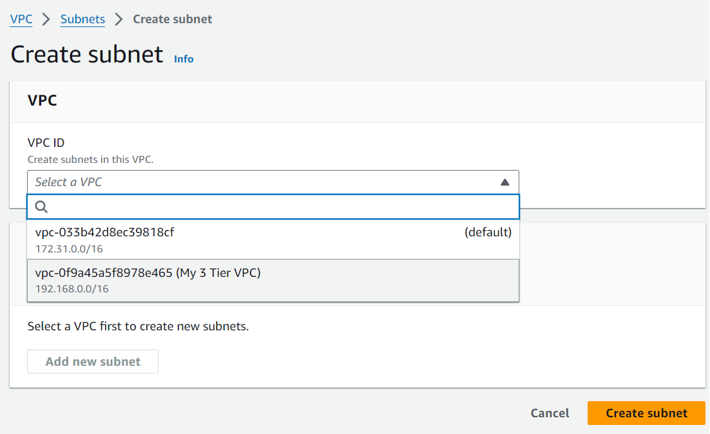
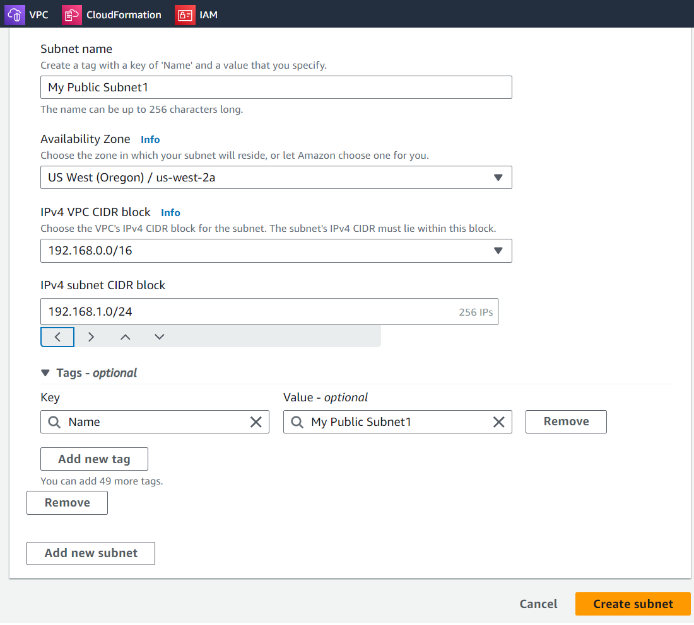
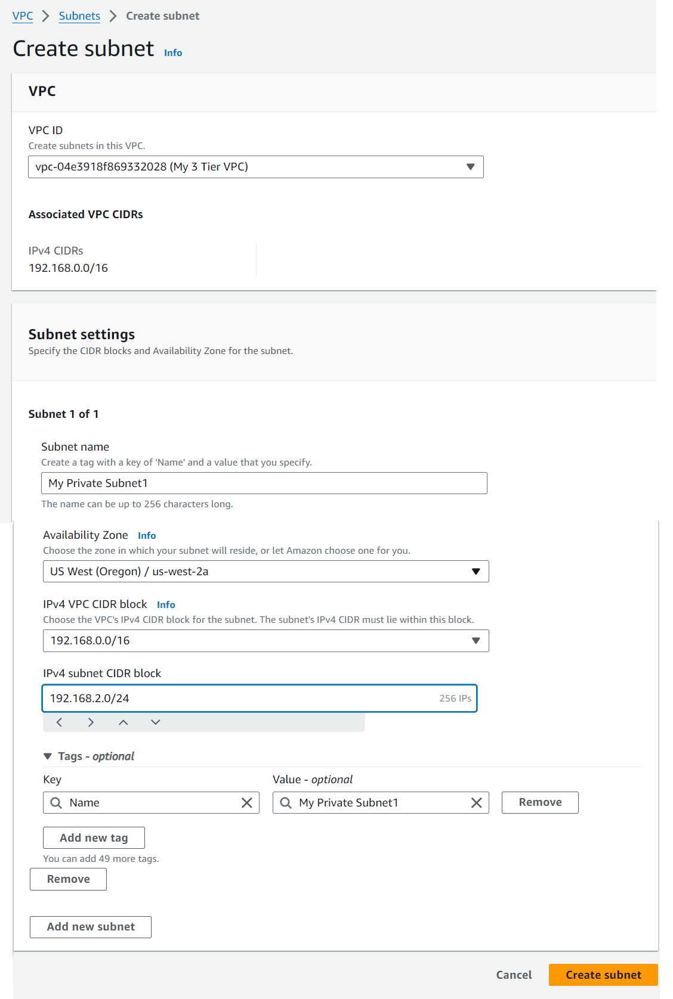

# 3-tier-AWS-Architecture
Please find below my first of a series of projects to design and configure a highly available 3 Tier architecture using AWS infrastructure. The 3 Tier are given below as shown 
- Tier 1 - User/Presentation Tier
- Tier 2 - Application Tier
- Tier 3 - Data Tier
  
See below the high level topology of 

Step 1: 
To begin with we will first setup the VPC which will host the entire 3 tier architecture.  In this step we will be creating a VPC and Subnets as well as routing and security groups. 
● Go to “Your VPCs” from the VPC service on the AWS management console and click on the orange “Create VPC” button. 

● Only create a vpc here and give it a name. Provide your own name or use the same one as shown here.

Now we will create Subnets, go to Subnets on the left hand side of the VPC service and click on it. 
- Add your VPC ID (select from the drop down where you will find it already is existing and select it. )

-	Assign it a name letting you know what it is your first public subnet
-	Put it in any availability zone and give it a CIDR of 192.168.1.0/24

-	Add a second subnet and name it Private Subnet 1 or something to let you know it is your first private subnet
-	Put it in the same availability zone as the first subnet you made and give it a CIDR of 192.168.2.0/24

