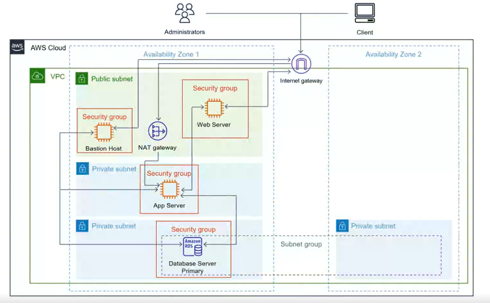

# 3-tier-AWS-Architecture
Please find below my first of a series of projects to design and configure a highly available 3 Tier architecture using AWS infrastructure. The 3 Tier are given below as shown 
- Tier 1 - User/Presentation Tier
- Tier 2 - Application Tier
- Tier 3 - Data Tier
  
See below the high level topology of 

